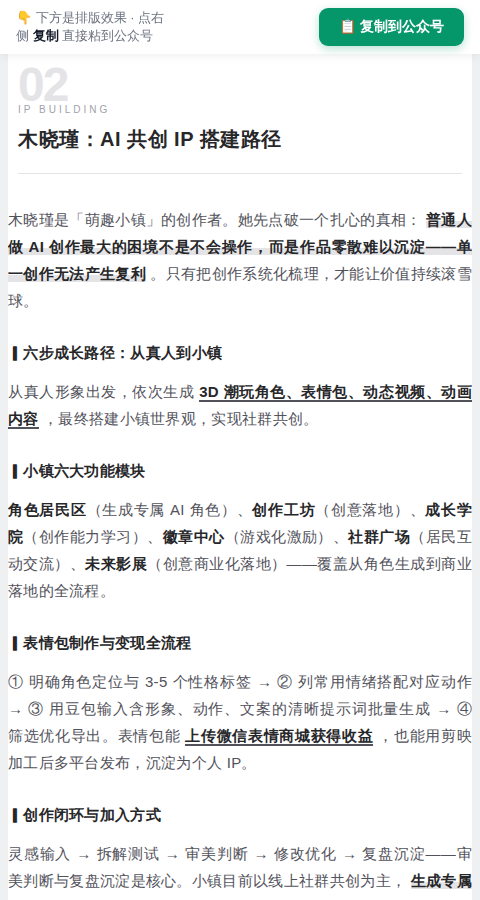

# 硬核派公众号写作标准（yinghepai-gzh-writing）

> 让硬核派的任何一位小伙伴写公众号文章，都能达到**硬核派公众号同款质量**——排版、格式、内容风格完全统一。
> **自包含**：排版组件库、校验脚本、真实范本全部打包，零外部依赖，任何 AI 拿到即可用。

---

## 🎯 用它，你能产出这样的文章

这是本 skill 真实产出的文章效果（「阅知未来·硬核AI科普」第三期收官，已发布）：

**首屏（引言卡金句 + 石墨极简排版）：**


**正文中部（章节标识 + 下划线强调 + 药丸标签）：**



**收官结尾（系列升华 + 品牌黄锚点）：**


> 💡 以上截图来自 `references/example-3rd-session.html`——一篇完整的已排版范本，你可以直接打开它看排版细节，也可以当模板改。

---

## ✨ 能产出什么类型的文章

| 类型 | 示例 | 效果 |
|------|------|------|
| **活动回顾** | 图书馆公益课三期 / 千问体验会 / 世界杯AI音乐大赛 | 引言卡金句 + 导师详写 + 现场互动 + 致谢 |
| **工具推荐** | 趣丸Tunee / 各类AI工具 | 痛点开头 + 每个工具「适合什么/内容/特征」 |
| **人物采访** | 导师/创作者专访 | 金句开场 + 成长线 + 干货 + 快问快答 |
| **赛事公告** | 海报周赛 / 世界杯MV大赛 | 主题 + 规则 + 奖项 + 参与方式 |

---

## 🚀 怎么用

### 方式一：给 AI 用（推荐，10 秒上手）
把 `yinghepai-gzh-writing/SKILL.md` 的内容作为写作规范 prompt 提供给任何 AI（Claude / GPT / Hermes / Codex 等），再给它素材（活动纪要、逐字稿、照片说明），它就会按硬核派标准输出完整可发布的文章。

**它内部会自动执行：**
1. 逐字读素材（含妙记逐字稿）→ 提取关键信息
2. 定结构（活动回顾/工具推荐/采访模板）
3. 按硬核派文风写正文（自然有温度、金句、段落3-5句）
4. 从自带组件库取排版组件（品牌黄/石墨下划线/引言卡）
5. 跑自带校验脚本（0 ERROR 才算过）
6. 生成带「复制到公众号」按钮的预览页

### 方式二：Hermes Agent 用户
```bash
cp -r yinghepai-gzh-writing ~/.hermes/skills/content-creation/
```

---

## 📁 文件结构（自包含，无外部依赖）

```
yinghepai-gzh-writing/
├── SKILL.md                          # 主规范（写作方法论 + 排版规范 + 更新日志）
├── examples/
│   └── quality-cases.md              # 好坏样例对照（好=已发布片段；坏=实际犯过的错）
├── evals/
│   └── evals.md                      # 最小评测集（3个case，改skill后跑一遍验证）
├── references/
│   ├── theme-graphite-minimal.md     # 石墨极简主题组件库（724行，排版组件全在这）
│   ├── common-components.md          # 通用组件（引言卡/数据卡/药丸标签等）
│   ├── hardcore-brand.md             # 硬核派品牌规范（配色/署名/VI）
│   ├── activity-review-template.md   # 三期真实范本（第一期正式/第二期活泼/第三期收官）
│   ├── example-3rd-session.html      # 第三期完整已排版 HTML 范本（可直接当模板）
│   └── feishu-minutes-scrape.md      # 飞书妙记抓取方法（素材获取）
├── scripts/
│   ├── validate_gzh_html.py          # 公众号 HTML 合规校验（0 ERROR 才算过）
│   ├── wrap_preview.py               # 生成带「复制到公众号」按钮的预览页
│   └── component_lint.py             # 组件检查
└── assets/
    ├── preview-template.html         # 预览页模板（wrap_preview 依赖）
    └── showcase/                     # 效果展示截图
```

**已验证：** 整个目录复制到全新环境，校验 + 预览脚本可直接运行（只依赖 Python 标准库）。

---

## ✍️ 核心规范速览

| 维度 | 规范 |
|------|------|
| 素材 | 逐字读妙记/逐字稿，不看总结 |
| 人名 | 以用户确认名单为准（语音转文字必错：木木=木晓瑾、冠子=赛博罐子）|
| 文风 | 自然有温度、朋友口吻、段落 3-5 句 |
| 标题 | ≤20 字、去专业术语、不夸大、不锁死数量 |
| 排版 | 石墨极简 + 品牌黄 #FFFB00 ≤3 处 + span leaf 包裹 |
| 金句 | 引言卡 + 品牌黄锚点，1-2 个让人记住的句子 |
| 署名 | 一律不署名（文章到 END 线结束）|
| 校验 | validate 脚本 0 ERROR |
| 收官期 | 系列成长线回顾 + 展望下一季 |

---

## 🛡️ 防坑指南（实际踩过的坑已固化为反例）

`examples/quality-cases.md` 收录了 6 个真实反例（用户批评过的）：标题锁死数量、官腔、品牌名写错（趣丸≠趣玩）、内容单薄、人名写错、markdown 符号进正文。AI 会主动避开这些坑。

---

## 🔄 持续进化机制

- **更新日志**：SKILL.md 末尾记录每次修改（v1.0→v1.1→v1.2）
- **评测集**：`evals/evals.md` 3 个 case，改完 skill 跑一遍确认没改坏
- **反馈飞轮**：使用中发现新坑 → 追加到 examples 反例 → 规范越来越准

## 📄 License
MIT
